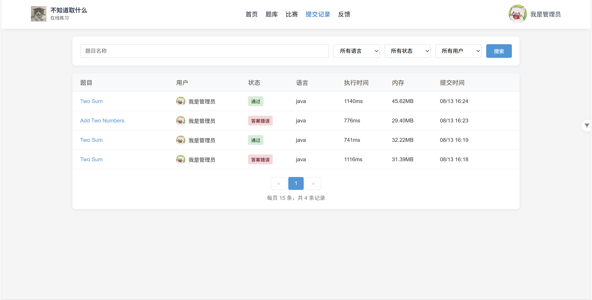

# 🚀 idolnoOJ - 智能在线判题系统

> 一个功能较为完整的在线判题系统，支持多语言代码提交、竞赛日历、AI互动问答、题目检索优化和代码沙箱等服务。系统能够根据管理员预设的测试数据对用户代码进行执行和测评，且自主实现的代码沙箱可作为独立服务供其他开发者调用。

[](https://openjdk.java.net/)
[](https://spring.io/projects/spring-boot)
[](https://vuejs.org/)
[](https://www.docker.com/)
[](LICENSE)

## ✨ 核心特性

### 🔒 安全可靠的代码执行
- **Docker容器隔离**: 基于Docker的代码执行环境，防止恶意代码攻击
- **多语言支持**: 基于模板方法，可支持多种编程语言，轻松扩展
- **资源限制**: 内存、CPU、执行时间等资源使用限制
- **沙箱隔离**: 完全隔离的执行环境，确保系统安全

### 🚀 高性能架构设计
- **异步处理**: Spring Boot异步任务，支持竞赛数据抓取
- **消息队列**: RabbitMQ异步消费判题模块，提升系统并发能力
- **缓存优化**: Redis缓存竞赛信息，显著提升查询性能
- **微服务架构**: 代码沙箱可作为独立服务部署

### 🤖 智能化功能
- **AI互动问答**: 提供编程问题解答和代码优化建议
- **智能判题**: 支持多种判题策略和自定义测试用例
- **竞赛日历**: 自动抓取和展示各类编程竞赛信息
- **题目检索**: 优化的搜索算法，快速定位目标题目

## 🏗️ 系统架构

### 整体架构图


### 判题逻辑流程


### 竞赛日历处理链


## 🛠️ 技术栈

### 后端技术
| 技术 | 版本 | 说明 |
|------|------|------|
| **Spring Boot** | 2.7+ | 主框架，提供Web服务和依赖注入 |
| **MySQL** | 8.0+ | 主数据库，存储题目、用户、提交等信息 |
| **MyBatis** | 3.5+ | ORM框架，简化数据库操作 |
| **Redis** | 7.0+ | 缓存数据库，提升查询性能 |
| **RabbitMQ** | 3.8+ | 消息队列，异步处理判题任务 |
| **Docker** | 20.0+ | 容器化技术，提供代码执行环境 |
| **JWT** | - | 身份认证和授权 |

### 前端技术
| 技术 | 版本 | 说明 |
|------|------|------|
| **Vue** | 3.0+ | 渐进式JavaScript框架 |
| **Pinia** | 2.0+ | 状态管理库 |
| **Vue Router** | 4.0+ | 前端路由管理 |
| **Vite** | 4.0+ | 现代化构建工具 |
| **Element Plus** | 2.0+ | UI组件库 |

### 开发工具
- **IDE**: IntelliJ IDEA / VS Code
- **构建工具**: Maven
- **版本控制**: Git
- **容器管理**: Docker Desktop

## 📁 项目结构

```
idolnoOJ/
├── oj_backend/           # 后端服务 (Spring Boot)
│   ├── src/main/java/   # Java源代码
│   ├── src/main/resources/ # 配置文件
│   └── pom.xml          # Maven依赖配置
├── oj_front/            # 前端应用 (Vue 3)
│   ├── src/             # 源代码
│   ├── public/          # 静态资源
│   └── package.json     # 依赖配置
├── oj_codesandbox/      # 代码沙箱服务
│   ├── src/main/java/   # 沙箱核心代码
│   └── pom.xml          # 依赖配置
├── database.sql         # 数据库初始化脚本
└── README.md            # 项目说明文档
```

## 🚀 快速开始

### 环境要求
- Java 11+
- Node.js 16+
- MySQL 8.0+
- Redis 7.0+
- Docker 20.0+
- RabbitMQ 3.8+

### 1. 克隆项目
```bash
git clone https://github.com/XiaoZhuDaBai/idolnoOJ.git
cd idolnoOJ
```

### 2. 后端服务启动
```bash
cd oj_backend
mvn clean install
mvn spring-boot:run
```

### 3. 前端应用启动
```bash
cd oj_front
npm install
npm run dev
```

### 4. 代码沙箱启动
```bash
cd oj_codesandbox
mvn clean install
mvn spring-boot:run
```

### 5. 数据库初始化
```bash
mysql -u root -p < database.sql
```

## 📸 功能展示

### 🏠 首页


### 📚 题库管理


### 💻 答题面板


### 🖥️ 控制台输出


### 📅 竞赛日历


### 📊 提交记录


## 🔧 配置说明

### 数据库配置
在 `oj_backend/src/main/resources/application.yml` 中配置数据库连接信息：

```yaml
spring:
  datasource:
    url: jdbc:mysql://localhost:3306/idolnooj
    username: your_username
    password: your_password
```

### Redis配置
```yaml
spring:
  redis:
    host: localhost
    port: 6379
    password: your_password
```

### Docker配置
确保Docker服务已启动，并配置相应的权限。
